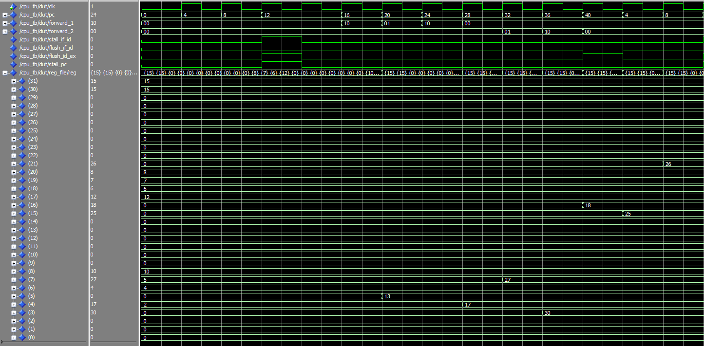

# Pipelined RISC-V RV32I CPU

**5-Stage Pipeline** of the RISC-V RV32I CPU with hazard control

Extension to the **[`Single-Cycle CPU`](../single_cycle/)**

## Features 
- **Pipeline Stages:** Instruction Fetch(IF) | Instruction Decode(ID) | Execute(EX) | Memory(MEM) | Write Back(WB)
- **Hazard Handling**
  - **Forwarding:** forwarding from EX/MEM and MEM/WB to ALU inputs when following instruction depends on ALU result 
  - **Load-use Stalls:** stalls PC + IF/ID & flushes ID/EX if lw doesn't reach MEM (lw hasn't read yet)
  - **Branch Flushing:** predicts branch not taken & flushes IF/ID + ID/EX if branch is taken

## Repository Structure
- src/ -- contains entities
- tb/ -- contains testbenches

## Top-Level Entity ([`cpu.vhd`](src/cpu.vhd))
### Datapath Blocks 
- Pipeline registers: registers to store signals from stages
  - if_id_register
  - id_ex_register
  - ex_mem_register
  - mem_wb_register
- hazard_unit: handles hazards (selects for forward handling muxes & pipeline register flushing/stalling for load-use stalls and branch flushing)
- mux3to1: for write back mux & forward hazard handling
- Shared with Single-Cycle
  - instruction_mem: fetches 32-bit instruction at pc
  - register_file: 32 registers, 2 read + 1 write ports
  - control_unit: decodes instructions & generates control signals
  - sign_extender: decodes/extends immediates
  - alu: computes arithmetic/logic
  - data_memory: load/store support 
  - write_back_mux: selects write back for register file
  - program_counter: updates pc (jump + branch support)
  
## ISA Supported (Same as Single-Cycle)
### ALU Operations
- **R-type:** ADD, SUB, SLL, SLT, SLTU, XOR, SRL, SRA, OR, AND
- **I-type:** ADDI, SLLI, SLTI, SLTIU, XORI, SRLI, SRAI, ORI, ANDI

### Loads / Stores
- **Load (I-type):** LW
- **Store (S-type):** SW

### Control Flow
- **Jump (J-type):** JAL
- **Branch (B-type):** BEQ

## Verification

### Register Initializations (located in [`Register File`](src/register_file.vhd))
- x4  = 2  
- x6  = 4  
- x7  = 5  
- x8  = 10  
- x17 = 12  
- x18 = 6  
- x19 = 7  
- x20 = 8  
- x30 = 15  
- x31 = 15  
- The rest are set to 0

### RAM Initializations (located in [`Data Memory`](src/data_memory.vhd))
- RAM[1] = 13  
- The rest are set to 0

### Instructions (located in [`Instruction Memory`](src/instruction_mem.vhd))
| PC   | Instruction              | Explanation |
|------|--------------------------|-------------|
| [0]  | `addi x0, x0, 0`         | nop |
| [4]  | `lw   x5, 0(x7)`         | x7 = 5 → byte address 5 → index: 5/4 = 1 (word aligned) → RAM[1] = 13 → x5 = 13 |
| [8]  | `add  x4, x5, x6`        | x4 = 13 + 4 = 17  **load-use stall** |
| [12] | `add  x7, x4, x8`        | x7 = 17 + 10 = 27 **forwarding** |
| [16] | `add  x3, x4, x5`        | x3 = 17 + 13 = 30 **forwarding** |
| [20] | `add  x16, x17, x18`     | x16 = 12 + 6 = 18 |
| [24] | `add  x15, x19, x16`     | x15 = 7 + 18 = 25 **forwarding** |
| [28] | `add  x21, x20, x16`     | x21 = 8 + 18 = 26 **forwarding** |
| [32] | `beq  x30, x31, -32`     | x30 = x31 = 15 → **branch taken** → PC goes back to [4] (loop) |
| [36] | `add  x15, x19, x16`     | Wrong path after branch taken → flushed |
| [40] | `add  x21, x20, x16`     | Wrong path after branch taken → flushed |

After the branch at [32], the PC jumps back to [4] and the sequence repeats.

### ModelSim Waveform

### Signals in Waveform
- `clk`
- `pc`
- `forward_1` (source 1 forward select), `forward_2` (source 2 forward select)
- `stall_if_id`, `flush_if_id`, `flush_id_ex`, `stall pc`
- `Registers`

**Note:** Only the most relevant signals are shown here. For more signals run the simulation on [`cpu_tb.vhd`](tb/cpu_tb.vhd).

