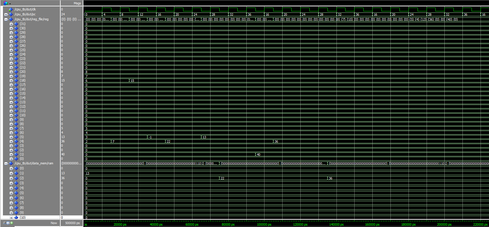

# Single-Cycle RISC-V RV32I CPU

## Repository Structure
- src/ -- contains entities
- tb/ -- contains test benches

## Top-Level Entity ([`cpu.vhd`](src/cpu.vhd))
### Datapath Blocks
- instruction_mem: fetches 32-bit instruction at pc
- register_file: 32 registers, 2 read + 1 write ports
- control_unit: decodes instructions & generates control signals
- sign_extender: decodes/extends immediates
- alu: computes arithmetic/logic
- data_memory: load/store support 
- write_back_mux: selects write back for register file
- program_counter: updates pc (jump + branch support)

## ISA supported
### ALU Operations
- **R-type:** ADD, SUB, SLL, SLT, SLTU, XOR, SRL, SRA, OR, AND
- **I-type:** ADDI, SLLI, SLTI, SLTIU, XORI, SRLI, SRAI, ORI, ANDI

### Loads / Stores
- **Load (I-type):** LW
- **Store (S-type):** SW

### Control Flow
- **Jump (J-type):** JAL
- **Branch (B-type):** BEQ  

## Verification
### Register Initializations (located in [`Register File`](src/register_file.vhd))
- x4 = 2
- x5 = 3
- x6 = 4
- x7 = 5
- x18 = 6
- x19 = 7
- x20 = 8

### RAM Initializations (located in [`Data Memory`](src/data_memory.vhd))
- RAM[1] = 13
- The rest are set to 0

### Instructions (located in [`Instruction Memory`](src/instruction_mem.vhd))
| PC  | Instruction        | Explanation |
|-----|--------------------|-------------|
| [0]  | `addi x0, x0, 0`  | nop |
| [4]  | `or   x4, x5, x6` | x4 = 3 \| 4 = 7 |
| [8]  | `add  x18, x19, x20` | x18 = 7 + 8 = 15 |
| [12] | `sub  x5, x6, x7` | x5 = 4 - 5 = -1 |
| [16] | `addi x4, x5, 23` | x5 = -1 → x4 = -1 + 23 = 22 |
| [20] | `andi x0, x0, 0`  | x0 remains 0 |
| [24] | `lw   x5, 0(x7)`  | load from data memory → x7=5 → index: 5/4=1 (word aligned) → RAM[1]=13 → x5 = 13 |
| [28] | `sw   x4, 4(x7)`  | store x4 = 22 → index: (5+4)/4=2 (word aligned) → RAM[2] = 22 |
| [32] | `beq  x7, x4, 4`  | branch not taken (x7 ≠ x4) |
| [36] | `jal  x1, -20`    | x1 = 40 (PC+4) → jump back 5 instructions to [16] |
| [16] | `addi x4, x5, 23` | x5 = 13 → x4 = 13 + 23 = 36 |

After the jump, the sequence repeats. The second execution of instruction [16] updates x4 = 36 and the following sw stores that value into RAM[2].

### ModelSim Waveform

### Signals in Waveform
- CLK
- PC
- Registers
- RAM

**Note:** Only the most relevant signals are shown here. For more signals run the simulation on [`cpu_tb.vhd`](tb/cpu_tb.vhd).
